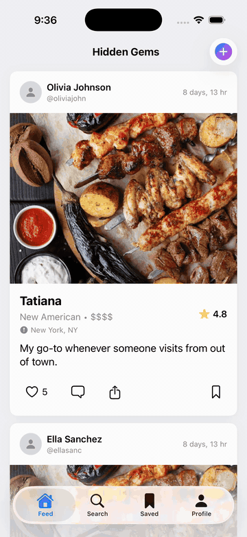

<div align="center">


# Hidden Gems

**A restaurant discovery app for locals, not tourists.**

Follow the people you trust, share the spots worth sharing, and skip the ones flooded by review-farm algorithms.


<br/>



</div>

---

## Why Hidden Gems?

Most food discovery apps optimize for the loudest crowds. Hidden Gems optimizes for the *right* crowd — the friends, coworkers, and locals whose taste you already trust. Every recommendation comes from a real person you chose to follow, with a note, a rating, and the vibe.

## Features

- **Feed** — A reverse-chronological feed of recommendations from people you follow. Like, comment, save, share. Tap a post's restaurant name to open the full posting history for that spot (Top / Recent toggle); tap the address to open directions in Apple Maps. Tab bar auto-hides on scroll-down and reappears on scroll-up.
- **Search** — Airbnb-style home stacked with one horizontal rail per curated vibe (`Date Night Spots`, `Quick Lunch`, `Late Night Eats`, `Lowkey Vibes`, `Good for Solo Dining`). Type in the field at any time to flip to a flat name/cuisine/location filter.
- **Saved** — A single-tap bookmark for every place you want to try. Unsaves are instant and optimistic; the tab pulls fresh state on appear and supports pull-to-refresh.
- **Profile** — Your grid of recommendations, your followers, and your following. Tap any user anywhere to open theirs.
- **Comments** — Threaded comments on every post, with per-comment likes. Order is frozen on open so liking a comment doesn't yank it to the top mid-read; reopen the sheet to re-sort.
- **Follow / Unfollow** — Build out your trusted taste graph; your feed fills up as you do.
- **Create** — Drop a new recommendation in seconds: place picker (Apple Maps only), category override, 1–5 star rating, up to 5 photos, caption, vibe tags. Re-posting a place prefills the rating from your last one — the form acts like an edit of your previous take.
- **Star ratings** — Each user has at most one rating per restaurant, stored in the `ratings` table keyed on `(user_id, restaurant_id)`. Set when posting; the feed card shows the community aggregate.
- **Sign in with Apple** — Native, nonce-verified, zero-friction onboarding. `loadProfile` self-heals a missing `public.users` row on sign-in so a user whose `on_auth_user_created` trigger didn't fire isn't stranded with FK-violating writes.

## Tech Stack

| Layer | Tooling |
|---|---|
| Client | SwiftUI, iOS 17+, `@Observable` state, `PhotosPicker`, `AsyncImage` |
| Auth | Supabase Auth (email/password + Sign in with Apple id-token exchange) |
| Data | Supabase Postgres with RLS; PostgREST via `supabase-swift` |
| Media | Supabase Storage (post photos) |
| Search | Postgres full-text + `pgvector` for vibe-tag similarity |
| CI / Ship | `xcodebuild` archive + `altool` upload + App Store Connect API (`scripts/ship.sh`) |

## Project Structure

```
Hidden Gems/
├── Hidden_GemsApp.swift      # App entry point + session restoration
├── ContentView.swift         # Root tab navigation + environment managers
├── FeedView.swift            # Recommendation feed (likes, comments, saves, share)
├── CommentsView.swift        # Comments sheet with per-comment likes
├── SearchView.swift          # Restaurant search
├── SavedView.swift           # Saved restaurants grid
├── ProfileView.swift         # Profile with follow/unfollow + recommendations grid
├── CreatePostView.swift      # New recommendation composer
├── AuthView.swift            # Sign in / sign up (email + Sign in with Apple)
├── LandingView.swift         # Signed-out landing
├── LocationManager.swift     # CoreLocation wrapper
├── SupabaseClient.swift      # Configured client + helpers
├── SharedComponents.swift    # Rating badge, async image, rest. meta, etc.
└── Models.swift              # Data models + state managers
```

## Getting Started

```sh
git clone git@github.com:divinedavis/Hidden-Gems.git
cd Hidden-Gems
open "Hidden Gems.xcodeproj"
```

Pick a simulator or a paired device and run. The Supabase URL and publishable key are compiled in; no local `.env` is required to run against the hosted backend.

## Development Workflow

Every change pushes to GitHub **and** uploads a new TestFlight build — the main branch is always shippable and the latest state is always testable on device.

### 1. Git

- Repo: `git@github.com:divinedavis/Hidden-Gems.git` (branch: `main`)
- After any code edit: `git add -A && git commit -m "<message>" && git push origin main`
- One logical change per commit; don't batch.

### 2. Documentation review

After every change, ask: *does this change introduce anything a future reader would benefit from?* If yes, update this README (or a sibling `.md`) before moving on. Things worth capturing:

- New scripts, commands, or CLI flags
- New config files, env vars, or required credentials
- Migrations to run, capabilities to enable, keys to rotate
- Non-obvious workflows or architectural decisions
- New integrations with external services

Trivia like bug fixes and UI tweaks don't need a README entry — the commit message covers them.

### 3. Migrations

Schema lives in `schema.sql` (full snapshot) with incremental files under `migrations/` numbered `NNN_description.sql`. To apply a new migration to the hosted Supabase project, run it via the management API:

```sh
curl -s -X POST "https://api.supabase.com/v1/projects/<project-ref>/database/query" \
  -H "Authorization: Bearer $SUPABASE_ACCESS_TOKEN" \
  -H "Content-Type: application/json" \
  -d "{\"query\": $(jq -Rs . < migrations/010_ratings.sql)}"
```

`SUPABASE_ACCESS_TOKEN` auto-exports from the macOS keychain (service `supabase-pat-clockin`). Migrations are forward-only; rolling back means writing the inverse as the next file.

### 4. TestFlight

```sh
./scripts/ship.sh
```

First-time setup:

1. Copy `scripts/asc-config.env.example` to `scripts/asc-config.env` and fill in the Issuer ID (App Store Connect → Users and Access → Integrations → App Store Connect API). `asc-config.env` is gitignored.
2. Place the API key at `~/.appstoreconnect/private_keys/AuthKey_<KEY_ID>.p8`.

The script bumps `CURRENT_PROJECT_VERSION` (ASC rejects duplicate build numbers), archives via `xcodebuild`, exports via `ExportOptions.plist`, and uploads via `xcrun altool`. Processing takes ~5 minutes before the build is testable.

After an icon or marketing-surface change, also attach the new build to the App Store version so the ASC dashboard thumbnail updates:

```sh
python3 scripts/attach_latest_build.py
```

A task is only complete once both the git push **and** the TestFlight upload succeed (and the doc review under §2 has been done — even if the answer is "nothing to add").

## Sign in with Apple

Native iOS Sign in with Apple is wired up end-to-end.

- `Hidden Gems/HiddenGems.entitlements` declares `com.apple.developer.applesignin = ["Default"]`, and `CODE_SIGN_ENTITLEMENTS` in `project.pbxproj` points at it.
- **Supabase one-time setup:** Authentication → Providers → Apple → *Enable*, then register `com.divinedavis.hiddengems` as a native **Client ID**. No client secret is needed for the native flow.
- The client generates a random nonce, hands `SHA256(nonce)` to `ASAuthorizationAppleIDProvider`, then exchanges the raw nonce + identity token via `supabase.auth.signInWithIdToken(...)`. See `LandingView.swift` and `AuthManager.signInWithApple` in `AuthView.swift`.

If the Apple provider isn't enabled in Supabase, the Apple button fails with *"Could not sign in with Apple. Please try again."* — enable the provider and retry.

## Screenshot harness

The DEBUG build reads a few environment variables so the screenshot/demo capture can be fully automated without synthesizing taps into the Simulator:

| Var | Effect |
|---|---|
| `HG_TEST_EMAIL` / `HG_TEST_PASSWORD` | Auto sign-in on launch if no session is restored. Also puts `LocationManager` in no-op mode so the permission dialog never covers the screen. |
| `HG_TEST_TAB=0..3` | Start on Feed / Search / Saved / Profile. |
| `HG_TEST_SHEET=comments` | Auto-present the Comments sheet against the first feed recommendation. |
| `HG_TEST_SHEET=create` | Auto-present the New Recommendation sheet. |
| `HG_TEST_REEL=1` | Cycle through all four tabs every 2.2s — used for recording `images/demo.gif`. |

All hooks are gated behind `#if DEBUG` and have no effect on release builds.

## Author

**Divine Davis** · [github.com/divinedavis](https://github.com/divinedavis)

<sub>© Divine Davis. All rights reserved.</sub>
