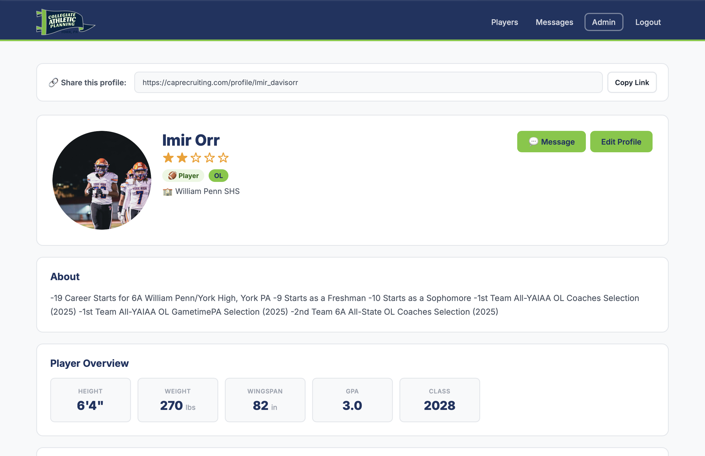

# Hidden Gems

An iOS app that gives locals better insight into what restaurants and cafes are around them — discover and share under-the-radar recommendations from people you trust.

## Screenshots

<p align="center">
  
</p>

## Features

- **Feed** — Browse restaurant recommendations from people you follow, with likes, comments, and saves
- **Search** — Find hidden gem restaurants by name, cuisine, or location
- **Saved** — Bookmark restaurants you want to try
- **Profile** — View your recommendations and manage followers/following
- **Comments** — Comment on posts and like other people's comments
- **Follow** — Follow other users and see their recommendations in your feed

## Tech Stack

- Swift / SwiftUI
- iOS 17+
- Xcode

## Project Structure

```
Hidden Gems/
├── Hidden_GemsApp.swift      # App entry point
├── ContentView.swift         # Root tab navigation + environment setup
├── FeedView.swift            # Recommendation feed with likes, comments, saves
├── CommentsView.swift        # Comments sheet with post image preview
├── SearchView.swift          # Search screen
├── SavedView.swift           # Saved restaurants
├── ProfileView.swift         # User profile with follow/unfollow
├── CreatePostView.swift      # Create a new recommendation post
├── SharedComponents.swift    # Reusable UI components
└── Models.swift              # Data models and state managers
```

## Getting Started

1. Clone the repo
2. Open `Hidden Gems.xcodeproj` in Xcode
3. Select a simulator or device and run

## Development Workflow

**Claude must push to GitHub *and* upload a new TestFlight build after every change.**

### 1. Git
- Repo: `git@github.com:divinedavis/Hidden-Gems.git` (branch: `main`)
- After any code edit: `git add -A && git commit -m "<message>" && git push origin main`
- Do not batch multiple unrelated changes into one commit — commit and push per logical change
- An auto-sync script also exists at `~/auto-push-hidden-gems.sh` (logs to `~/hidden-gems-autopush.log`), but Claude should still push explicitly after each change rather than relying on it

### 2. TestFlight
After the git push, ship a new build so the latest state is always testable on device. A one-shot script does the bump + archive + export + upload:

```sh
./scripts/ship.sh
```

First-time setup:
1. Copy `scripts/asc-config.env.example` to `scripts/asc-config.env` and fill in the Issuer ID (App Store Connect → Users and Access → Integrations → App Store Connect API). `asc-config.env` is gitignored.
2. Ensure the API key is at `~/.appstoreconnect/private_keys/AuthKey_<KEY_ID>.p8`.

The script bumps `CURRENT_PROJECT_VERSION` automatically (ASC rejects duplicate build numbers), archives with `xcodebuild`, exports via `ExportOptions.plist`, and uploads via `xcrun altool`. Processing in App Store Connect takes ~5 minutes before the build is testable.

Only report the task complete after both the git push **and** the TestFlight upload succeed.

## Author

Divine Davis
